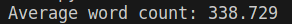
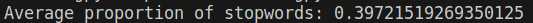

# Información importante del conjunto de datos

Una vez armado el conjunto de 1000 entradas dummy, se corrió un script para determinar ciertos datos importantes acerca del corpus de descripciones:

## Promedio de palabras de las descripciones

## Proporción de palabras cerradas

Para ver cómo se realizó este conteo, se puede referir a [el script que se usó para realizarlo](stopwordCount.py)
